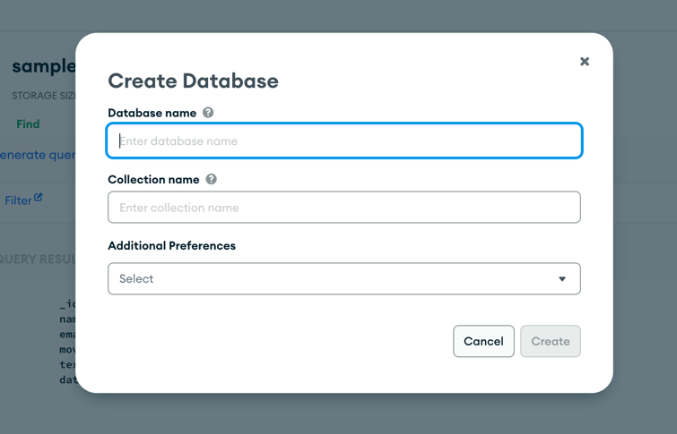

## Assignment 5 - Lab
### Due Date: 05/22/24 - 11:59pm EST

*Assignment deadlines are strictly enforced, please do try to hand in your assignments on time, and I will honor your commitment by grading them and giving feedback in a timely manner. I do understand that sometimes there may be emergencies that we need to attend to. Please do reach out to me as soon as possible if you know you won't be able to make a deadline.*

---

## Assignment Description

For this last assignment, we will be doing it in the format of a lab exercise instead of an assignment. You will need to follow the below instructions, and submit a lab report as part of this assignment. Note the required question/task at the end of each steps below to be included in your lab report.

For this lab, we will work on getting a Mongo Atlas cloud DB set up and connected to our sample ExpressJS server that has been set up for you. To do so, you will need to sign up for a free account on MongoDB, and create a free MongoDB Atlas database and populate it with their sample data.

---

## Lab Exercise Instructions

### Step 1
#### Setup MongoDB Atlas by following this tutorial: https://www.mongodb.com/basics/mongodb-atlas-tutorial
- You will need to create an account with MongoDB
- Preferred approach is to use your Google account to sign up, but you can also use GitHub or provide your own email.
- Once you have run through the tutorial, you should have a MongoDB Atlas server running, with sample data populated.
- In the `Accessing a MongoDB Atlas Cluster` step of the tutorial, for the purpose of this lab, allow IP access from anywhere to avoid running into connection issues when working on this lab from multiple locations (school, home, work, etc...)

#### Lab Report:
- With your MongoDB Atlas set up, navigate to your database, and click on the `Collections` tab.
- Take a screenshot of your db with the `sample_*` (yours might be a different type of sample collection data) collections populated. Example below:

- Include this screenshot in your lab report under a section titled `Step 1`.

### Step 2
#### Running your ExpressJS server
- The ExpressJS server code has already been set up for you with a few routes already defined.
- `cd` into the `server` directory in this assignment.
- Run `npm i` to install all the dependencies needed to run the server.
- Run `npm run start` to start up the server.
- You should see "Server Listening On Port:3000" displayed on your console/terminal.

#### Lab Report:
- With your ExpressJS server running, navigate to `http://localhost:3000` on your browser.
- Take a picture of the browser window.
- Include this screenshot in your report under a section titled `Step 2`

### Step 3
#### Connecting ExpressJS Server To MongoDB Atlas
- First, retrieve your URL connection string from your MongoDB Atlas dashboard by clicking on "Connect" from your "Database Deployments page".

- Then click on "Connect your application" option, and then select "NodeJS" on the "Driver" dropdown menu, and then copy the `uri` line below:

- Lastly, navigate to the ExpressJS server file in `server/server.js` and uncomment/replace your URI string and connection code on lines 11-13, and replace the `<username>` and `<password>` with the MongoDB cluster user that you created during `Step 1`.
- Note: You can also click "View full code sample" to see a similar template code to what was given in your `server.js` file.

#### Lab Report:
- You should now have your ExpressJS set up properly to connect to your MongoDB Atlas.
- Navigate to `http://localhost:3000/connection` on your browser and take a screenshot of what you see.
- Next, navigate to `http://localhost:3000/db/findOne/sample_airbnb/listingsAndReviews/` on your browser and take a screenshot of what you see.
- Submit these screenshots in your lab report, under a section titled `Step 3`.

### Step 4
#### Creating Our Own Database + Collection And Adding Data
- We will now create our own database & collection on our MongoDB Atlas cluster via their web interface.
- Navigate to your MongoDB cluster, and click "+ Create Database" to have the below modal pop up, asking for a new DB name/collection.

- Once the database and collection has been created, add some dummy data to your collection by clicking "Insert Document".
- In my example below, I have my database `hunter_webdev` and the collection `student_roster`.

- Once you have a document inserted into your new collection, proceed to the lab report step below.

#### Lab Report:
- Now that you've created a new collection, let's try and view it via ExpressJS.
- Next, navigate to `http://localhost:3000/db/findOne/<YOUR_NEW_DB>/<YOUR_NEW_COLLECTION>/` on your browser, replacing `<YOUR_NEW_DB>` and `<YOUR_NEW_COLLECTION>` portion of the URL string with the new db and collection that you just created.
- Take a screenshot of what you see on your browser, and attach it to your lab report under a section titled `Step 4`.

---

## Submission

Unlike your assignments, you will be **REQUIRED** to submit this lab report on BlackBoard. Please submit a document as part of the submission on BlackBoard for this lab assignment, preferably in PDF form if possible. Alternatively, if you choose to use Google Docs, you can also submit a link (ensure I have read access) as part of the submission.